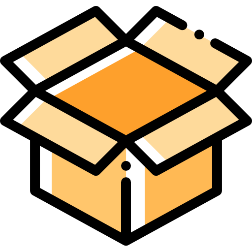
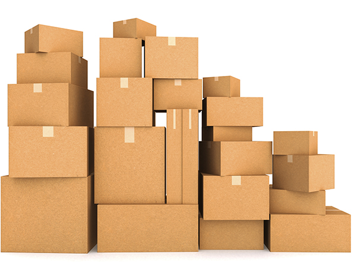

CAJISTRATORS: L'Univers de les caixes

CAJISTRATORS és una plataforma web dedicada a l'exploració, disseny i catalogació de tot tipus de caixes i solucions d'emmagatzematge.

📖 Descripció del Blog
Aquest projecte neix de la necessitat de centralitzar informació tècnica i creativa sobre el món del packaging. No és només una llista de productes, sinó un blog interactiu on els usuaris poden:

Explorar: Articles sobre materials sostenibles (cartró, bioplàstics, fusta).

Aprendre: Tutorials sobre com optimitzar l'espai i crear embalatges personalitzats.

Funcionalitats: Sistema de filtrat per mides, calculadora de volum de caixes i una secció de comentaris per a la comunitat.

Objectiu: Estem desenvolupant aquesta web per donar a coneixer a la gent sobre aquest maravillos mon.

🖼️ Demo i Captures
Exemple del nostre Codi (HTML Semàntic)

                <nav class="navbar">
                    <ul>
                        <li><a href="index.html">Inici</a></li>
                        <li><a href="Contact.html">Contactans</a></li>
                        <li><a href="obout.html">Sobre nosaltres</a></li>
                        <li><a href="login.html">Inicia sessió</a></li>
                        
                    </ul>
                </nav>
            

        

    </header>

    <main class="container">
    <section class="hero">
        

            <h2>Qui som?</h2>
            
Som un grup de 3 estudiants que ens hem unit per crear una pàgina web sobre caixes.

            
A través de aquest lloc web, es presenten els diferents models de
                caixes, les seves característiques, usos possibles i com adquirir-les.

        

        

            
        

        

            <h3>Vídeo tutorial</h3>
            <iframe class="video" width="420" height="236"
                src="https://www.youtube.com/embed/5-g0wUWuv_M?si=sfO9Z0TT461RdPWC" title="YouTube video player"
                frameborder="0" allow="accelerometer; autoplay; clipboard-write; encrypted-media; gyroscope; picture-in-picture; web-share"
                referrerpolicy="strict-origin-when-cross-origin" allowfullscreen></iframe>
        

    </section>

    

🛠️ Tecnologies Utilitzades

- Llenguatges per l'estructura.
   1. pel disseny i les animacions.
- Eines i Recursos:
   1. VS Code: Editor de codi.
   2. Google Fonts: Tipografies (ex: Roboto o Montserrat).
   3. GitHub Pages: Per al desplegament en línia.
 
🚀 Instal·lació i Ús
Com que és una pàgina estàtica, no necessites instal·lar dependències. Només cal que segueixis aquests passos:

1. Clonar el repositori:
git clone https://github.com/ZetaSakai/blog.git
2. Navegar a la carpeta:
cd nom-del-projecte
3. Execució:
Simplement obre el fitxer index.html en el teu navegador preferit.

📂 Estructura del Projecte
box-blog/
├── img/                # Imatges i icones del projecte
├── css/
│   └── style.css       # Full d'estils principal
├── index.html          # Pàgina principal
├── contacte.html       # Formulari de contacte
└── README.md           # Documentació (aquest fitxer)

👥 Autors i Contribucions
- Marc - @ KikeMontillaTirabuzón - Disseny i Desenvolupament Complet.
- Daniel - @ daneducem - Disseny i Desenvolupament Complet.
- Reitman - @ ZetaSakai - Disseny i Desenvolupament Complet.

Vols col·laborar? Si trobes algun error en el CSS o vols suggerir una millora visual, obre un Issue!

📄 Llicència
Aquest projecte és de codi obert sota la llicència MIT.

Fet amb passió per les caixes i el codi net.

🗺️ Roadmap (Millores futures)
1. Afegir interactivitat amb JavaScript (com un mode fosc).

2. Crear una secció de galeria amb un filtre de categories.

3. Millorar les animacions de transició entre pàgines.
